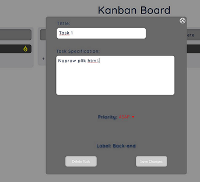
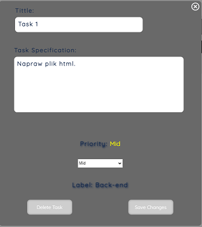
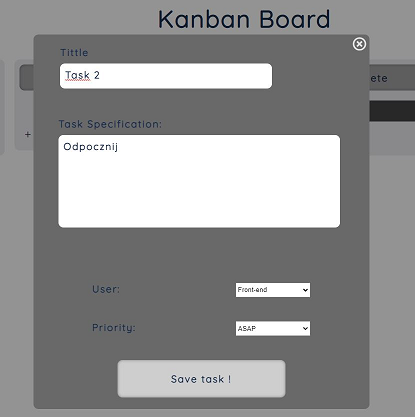
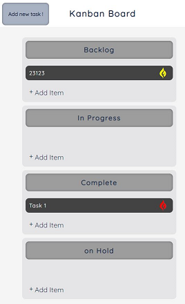

# kanban-board-project





## Table of contents

* [General info](#general-info)
* [Technologies](#technologies)
* [Setup](#setup)

## General info

This project shows some possibilities with pure javascript and how we can easly planning our work-day with minimum effort. 
On this site we can easly create new tasks in specific column. Also we can edit, changing priority, move tasks to another 
column or delete them if we don't need them anymore! Page can save our notes and tasks in browser memory. When we use 
mobile devices, application will switch to a mobile view. większość. Majority of the code, including html tree, was 
written in js files.
## Technologies

Project is created with:
* Html
* CSS
* Pure Javascript mostly

## Setup

To run this project, visit this link only or download this project to your own computer:

```
https://kanban-board-j.netlify.app/
```